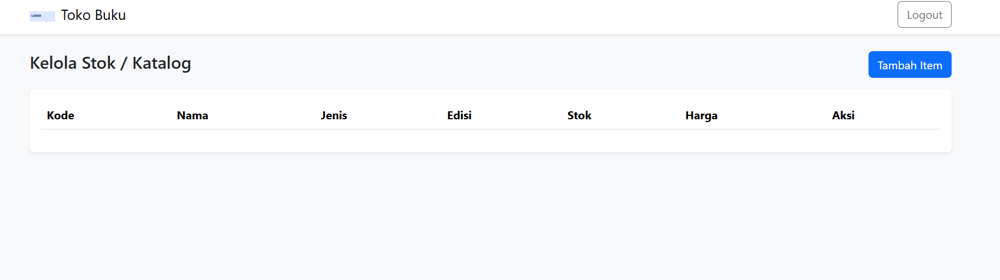
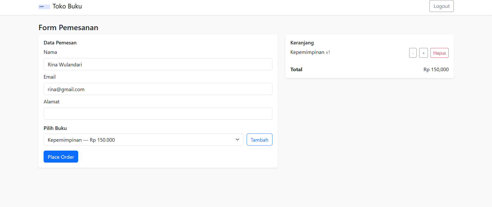
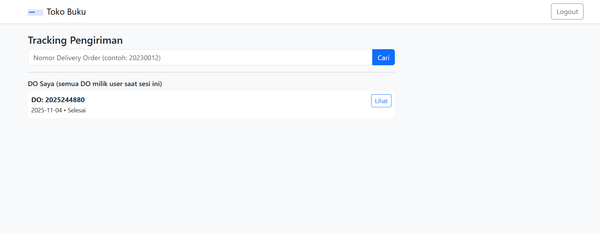

README - Tugas UTS Pemrograman Web 1 

Nama: Arfianda Firsta Satritama
NIM: 312410377
----------------------------------------------------
Struktur folder: (sesuai soal)
- index.html (login)
- dashboard.html (role-based: Admin/User)
- stok.html (admin only)
- checkout.html (user only)
- tracking.html (user only)
- css/style.css
- js/data.js  <-- file data sesuai yang Anda berikan (tdk diubah)
- js/script.js
- assets/logo.png 
- img/... 

Akun contoh (ada di data.js):
- User: rina@gmail.com / rina123
- User: agus@gmail.com / agus123
- Admin: arfianda@gmail.com / arfianda123

Petunjuk singkat:
1. Buka index.html, login dengan salah satu akun di atas.
2. Setelah login, akan diarahkan ke dashboard. Navigation menyesuaikan role:
   - Admin: lihat menu "Informasi Stok / Katalog" (stok.html) untuk kelola buku.
   
   
   - User: gunakan "Pemesanan" (checkout.html) dan "Tracking" (tracking.html).

   

   
3. Semua aksi bersifat simulasi (client-side). Data tersimpan hanya di memori halaman (sessionStorage).
